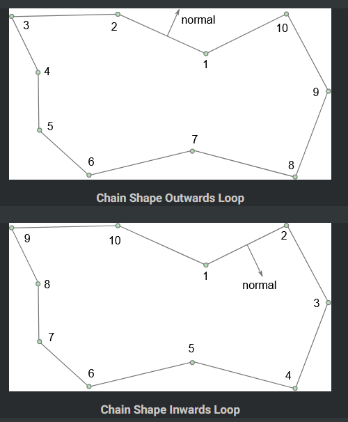
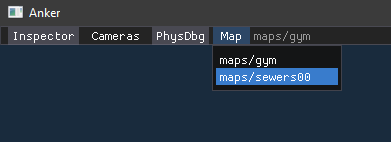

# Map Creation

## Tiled

Use [Tiled](https://www.mapeditor.org/) with the following settings when creating a map:

- Orientation: Orthogonal
- Tile layer format: Base64 (uncompressed)
- Map size: Fixed

Save the map *JSON map file* `.tmj` inside `assets/maps`.

Inspect the game console for errors and warnings when loading a map.

## Tile Sets

Store tile sets in inside `assets/maps/tilesets` as *JSON tileset file* `.tsj` along with the texture.

## Layers

Object layers starting with the word `Collision` as their name are used to generate colliders.
We currently support the following types of colliders:

- Box
- Polygon
- Polyline (for semi-solid platforms)

Semi-solid platforms are defined on their own object layer named `CollisionPlatforms`.

Pay special attention to the direction (clockwise vs. counter-clockwise) when drawing a polygon or polyline ([see](https://box2d.org/documentation/md__d_1__git_hub_box2d_docs_collision.html)).

## Entities

Tiled templates defined in `assets/maps/entities` can be used as placeholders.
On map load, the engine replaces these placeholders with the actual entity defined in the game's code.

## Tiled Classes

- Use the `Map` class for maps.

## Map Selection

Maps inside the `assets/maps` folder are automatically picked up by the engine and are listed in the editor's map selection menu.

Press `F5` to reload the current map.

Note: While textures are reloaded automatically as soon as they change, tile sets are only (re)load during map load.
